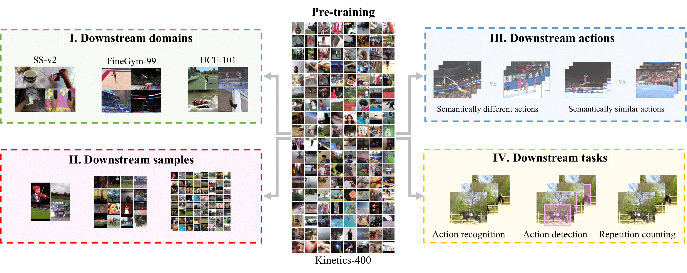

# SEVERE Benchmark

Official code for our ECCV 2022 paper [How Severe is Benchmark-Sensitivity in Video
Self-Supervised Learning?](https://arxiv.org/abs/2203.14221)

TL;DR. We propose the SEVERE (<ins>SE</ins>nsitivity of <ins>V</ins>id<ins>E</ins>o <ins>RE</ins>presentations) benchmark for evaluating the generalizability of representations obtained by existing and future self-supervised video learning methods.

<--

-->


## Overview of Experiments 
We evaluate 9 video self-supervised learning (VSSL) methods  on  7 video datasets  for 6 video understanding tasks.

### Evaluated VSSL models

Below are the video self-suprevised methods  that we evaluate.

| Model | URL |
|-------|-----|
| SeLaVi| https://github.com/facebookresearch/selavi |
| MoCo| https://github.com/tinapan-pt/VideoMoCo |
| VideoMoCo | https://github.com/tinapan-pt/VideoMoCo |
| Pretext-Contrast | https://github.com/BestJuly/Pretext-Contrastive-Learning  |
| RSPNet | https://github.com/PeihaoChen/RSPNet |
| AVID-CMA | https://github.com/facebookresearch/AVID-CMA |
| CtP | https://github.com/microsoft/CtP |
| TCLR | https://github.com/DAVEISHAN/TCLR |
| GDT | https://github.com/facebookresearch/GDT |
| Supervised | https://pytorch.org/vision/0.8/_modules/torchvision/models/video/resnet.html#r2plus1d_18 |


* For SeLaVi, MoCo, VideoMoCO, Pretext-Contrast, CtP, TCLR and GDT we use the Kinetics-400 pretrained R(2+1D)-18 weights provided by the Authors.
* For RSPNet and AVID-CMA the author provided R(2+1D)-18 weights differ from the R(2+1D)-18 architecture defined in ['A Closer Look at Spatiotemporal Convolutions for Action Recognition'](https://arxiv.org/abs/1711.11248). Thus we use the official implementation of the RSPNet and AVID-CMA and to pretrain with the common R(2+1D)-18 backbone on Kinetics-400 dataset.
* For Supervised, We use the Kinetics-400 pretrained R(2+1D)-18 weights from the pytorch library.

Download Kinetics-400 pretrained R(2+1D)-18 weights for each method from [here](https://surfdrive.surf.nl/files/index.php/s/Zw9tbuOYAInzVQC). Unzip the downloaded file and it shall create a folder `checkpoints_pretraining/` with all the pretraining model weights.

## Experiments

We divide these downstream evaluations across four axes:

### I. Downstream domain-shift

We evaluate the sensitivity of self-supervised methods to the domain shift in downstream dataset  with respect to the pre-training dataset i.e. [Kinetics](https://arxiv.org/abs/1705.06950).

Please refer to [action_recognition/README.md](./action_recognition/README.md) for steps to reproduce the experiments with varying downstream domain datasets like .

### II. Downstream sample-sizes

We evaluate the sensitivity of self-supervised methods to the amount of downstream samples available for finetuning.

Please refer to [action_recognition/README.md](./action_recognition/README.md) for steps to reproduce the experiments with varying downstream samples.

### III. Downstream action granularities

We investigate whether self-supervised methods can learn fine-grained features required for recognizing semantically similar actions. 
<!---
We evaluate on various subsets defined for  [Fine-Gym](https://sdolivia.github.io/FineGym/) dataset.
-->

Please refer to [action_recognition/README.md](./action_recognition/README.md) for steps to reproduce the experiments with varying downstream actions.

### IV. Downstream task-shift

We study the sensitivity of video self-supervised methods to nature of the downstream task. 

**In-domain task shift**: For task-shift within-domain, we evaluate  the UCF dataset for the task of repetition counting. Please refer to [Repetition-Counting/README.md](./Repetition-Counting/README.md) for steps to reproduce experiments.

**Out-of-domain task shift**: For task-shift as well as domain shift,  we evaluate on multi-label action classification on Charades and action detection on AVA. Please refer to [action_detection_multi_label_classification/README.md](./action_detection_multi_label_classification/README.md) for steps to reproduce the experiments.

## The SEVERE Benchmark

From our analysis we distill the SEVERE-benchmark, a subset of our experiments, that can be useful for evaluating current and future video representations beyond standard benchmarks.


### Citation

If you use our work or code, kindly consider citing our paper:
```
@article{thoker2022severe,
  author    = {Thoker, Fida Mohammad and Doughty, Hazel and Bagad, Piyush and Snoek, Cees},
  title     = {How Severe is Benchmark-Sensitivity in Video Self-Supervised Learning?},
  journal   = {ECCV},
  year      = {2022},
}
```


### Acknowledgements

### Maintainers

* [Fida Thoker](https://fmthoker.github.io/)
* [Piyush Bagad](https://bpiyush.github.io/)

:bell: If you face an issue or have suggestions, please create a Github issue and we will try our best to address soon.
